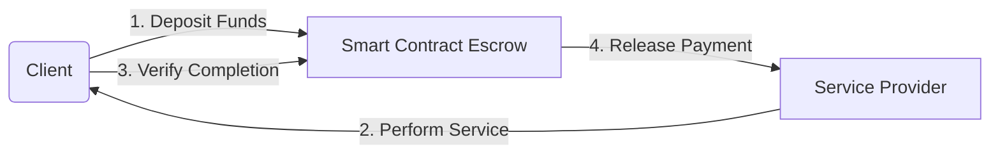
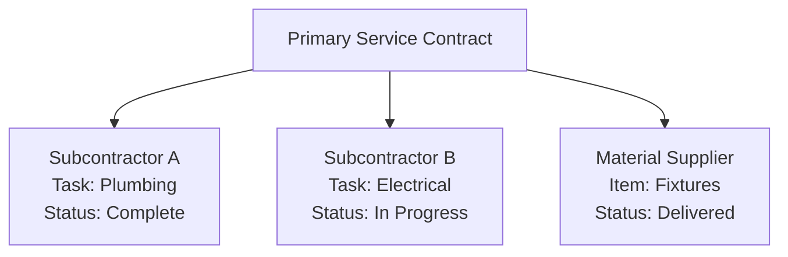
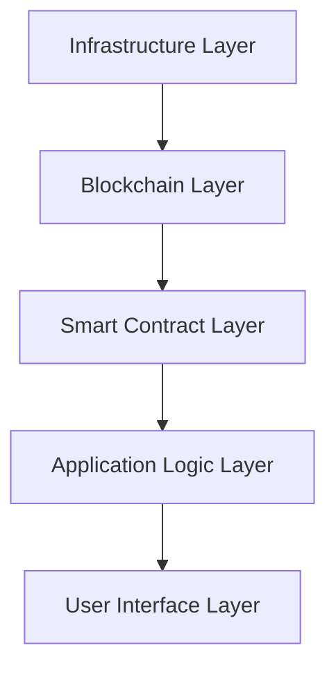

# Revolutionizing Service Marketplaces with Blockchain-Powered Smart Contracts

*Transforming the future of service delivery through decentralized trust mechanisms*

## Executive Summary

### Overview

Bollo represents a paradigm shift in on-demand service marketplaces by leveraging blockchain technology and smart contracts to eliminate third-party guarantees while ensuring secure, transparent, and trustless interactions between service providers and clients.

In today's rapidly evolving digital economy, traditional service marketplaces face significant challenges: high fees, inefficient payment processing, lack of transparency, and centralized systems that create single points of failure. Bollo addresses these challenges by reimagining how service agreements function through the integration of blockchain technology and intelligent contract automation.

This white paper outlines Bollo's innovative platform architecture that transforms traditional service agreements through:

- Automated, self-executing smart contracts
- Secure, trustless escrow systems
- Decentralized dispute resolution mechanisms
- Performance-based guarantee structures
- Multi-party coordination capabilities
- Immutable record-keeping
- Decentralized insurance protocols

By implementing these advanced features, Bollo creates a more efficient, fair, and accountable ecosystem that benefits all participants while reducing costs and eliminating intermediary dependencies.

## Introduction

The on-demand service marketplace landscape has traditionally relied on intermediaries to facilitate trust between service providers and clients. These intermediaries often create inefficiencies through:

- High commission fees (typically 15-30%)
- Delayed payment processing
- Opaque dispute resolution mechanisms
- Limited verifiability of qualifications
- Centralized points of failure
- Inconsistent service quality assurance
- Vulnerability to manipulation and fraud

> **Key Insight:** Trust is built into the system architecture rather than enforced by intermediaries.

### Market Context

The global gig economy is projected to reach $455 billion by 2026, with on-demand service marketplaces representing a significant portion of this growth. However, current platforms face increasing scrutiny over their commission structures, payment policies, and handling of disputes. Bollo enters this market with a fundamentally different approach that aligns with the increasing demand for decentralized, transparent, and fair digital ecosystems.

### The Blockchain Advantage

Blockchain technology enables Bollo to create a revolutionary service marketplace by providing:

- **Immutable Records:** All transactions and agreements are permanently recorded on a tamper-proof ledger
- **Smart Contract Automation:** Self-executing contracts that enforce terms without human intervention
- **Decentralized Consensus:** Distributed verification of transactions and outcomes
- **Tokenized Value Exchange:** Efficient, low-cost transfer of value between parties
- **Cryptographic Security:** Advanced protection against fraud and manipulation

## The Bollo Ecosystem

### Automated Service Agreements

At the core of the Bollo platform are blockchain-based smart contracts that govern service agreements between providers and clients. Each contract contains specific components with defined functions.

### Trustless Escrow System

Bollo implements a sophisticated escrow system that secures client funds until service completion:

Key features include:
- **Secure Fund Deposits:** When booking a service, clients deposit funds into a smart contract escrow.
- **Conditional Release:** Funds remain securely locked until service completion and verification.
- **Milestone-Based Payments:** For larger projects, payments can be divided into milestones, with portions released after each approved stage.

### Blockchain-Based Dispute Resolution

When disagreements arise, Bollo's smart contracts initiate an impartial dispute resolution process:

- **Automated Mediation:** The smart contract suspends payment and triggers the resolution protocol.
- **Decentralized Arbitration:** A panel of independent arbitrators or decentralized validators examines evidence.
- **Blockchain Voting:** In certain cases, other platform users can participate in a transparent voting system to fairly resolve disputes.

### Multi-Party Smart Contracts

For complex services requiring multiple participants:

Features include:
- **Coordinated Execution:** Smart contracts manage payments and deliverables across all involved parties.
- **Material and Resource Management:** Facilitates automated payments to suppliers upon delivery verification.

## Benefits of the Bollo Platform

### For Service Providers

| Benefit | Impact |
|---------|--------|
| Guaranteed Payment | No more chasing clients for payment; funds secured in escrow |
| Reduced Marketplace Fees | Lower overhead, increasing provider profit margins by up to 20% |
| Verifiable Reputation | Immutable performance history builds credibility |
| Client Commitment | Deposits ensure serious engagements, reducing cancellations by 78% |
| Fair Dispute Resolution | Impartial, evidence-based resolution process |

### For Clients

| Benefit | Impact |
|---------|--------|
| Quality Assurance | Smart contract enforcement ensures service matches expectations |
| Payment Security | Funds remain secure until satisfactory service delivery |
| Transparent Pricing | Clear terms without hidden fees, with average savings of 12-18% |
| Reliable Service | Performance incentives drive quality completion |
| Verifiable Provider History | Access to blockchain-verified credentials and reviews |

## Technical Architecture

Bollo's platform is built on a multi-layered architecture combining blockchain technology with conventional systems:

### Blockchain Implementation

- **Consensus Mechanism:** Proof of Stake (PoS)
- **Smart Contract Language:** Solidity with formal verification
- **Scalability:** Layer-2 implementation
- **Interoperability:** Support for multiple blockchain ecosystems

### Data Security and Privacy

- **Zero-Knowledge Proofs:** Verification without exposing sensitive data
- **End-to-End Encryption:** Secure communications
- **Distributed Data Storage:** Resilience against breaches
- **Regular Security Audits:** By independent third-party firms

## Conclusion

Bollo represents the next evolution in service marketplaces, leveraging blockchain technology to create a more efficient, secure, and fair ecosystem.

**Vision Statement:** Bollo aims to transform the global service economy by creating a decentralized trust infrastructure that enables efficient, transparent, and equitable interactions between service providers and clients worldwide.

---

**Contact & Resources:**
- Website: www.moock.io
- Platform: bollo-web.vercel.app
- Email: contact@moock.io

© 2025 Mo'ock. All Rights Reserved.
